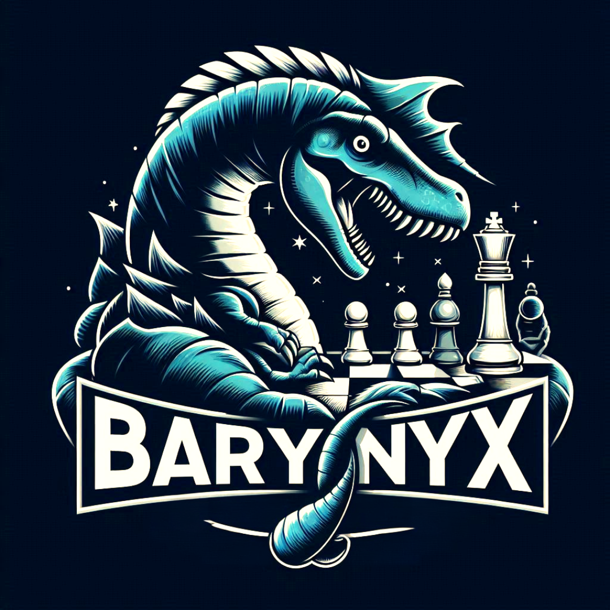

<div align="center">



# Baryonyx

[![License][license-badge]][license-link]
[![Build][build-badge]][build-link]
[![Commits][commits-badge]][commits-link]

</div>

## Overview

Baryonyx is a work-in-progress UCI-compliant chess engine written in C++, initially based on my previous C
engine [Nibble][nibble].
It is a personal project with the goal of learning modern C++ and chess programming.

## Features

- Board representation & Move generation
    - [Bitboards][bitboards]
        - [Magic Bitboards][magic-bitboards]
        - [PEXT Bitboards][pext-bitboards]
    - [Copy-Make][copy-make]
    - [Pseudo-legal Move Generation][pseudo-legal-movegen]
    - [Zobrist Hashing][zobrist]
- Evaluation
    - [Material][material]
    - [Texel-tuned Piece-Square Tables][psqts]
    - [Tempo][tempo]
    - [Tapered Evaluation][tapered-eval]
- Search
  - [Negamax with Alpha-beta pruning][negamax]
  - [Iterative deepening][id]
  - [Quiescence Search][qsearch]
  - [Move Ordering][move-ordering]
    - [TT move][tt-move]
    - [MVV-LVA][mvv-lva]
    - [Killer Moves][killers]
    - [History Heuristic][history-heuristic]
  - [Transposition Table][transposition-table]
  - [Principal Variation Search][pv-search]
  - [Reverse Futility Pruning][rfp]
  - [Null Move Pruning][nmp]

## Building

Since Baryonyx is written in C++23, you'll need a recent version of g++/clang++ (g++ >= 13 / clang++ >= 17) to build it.
See [compiler-support][compilers] for reference.

To create a working executable, follow this steps:

1. Clone the repository: ```git clone https://github.com/IbaiBuR/Baryonyx.git```
2. Go to the directory of the repository: ```cd Baryonyx```
3. Run make: ```make```

> [!NOTE]
> It is recommended to use clang++ instead of g++, as it usually produces faster binaries.
> If you prefer to use with g++, you can specify it when running make -> make CXX=g++

[license-badge]: https://img.shields.io/github/license/IbaiBuR/Baryonyx?style=for-the-badge
[build-badge]: https://img.shields.io/github/actions/workflow/status/IbaiBuR/Baryonyx/build.yml?style=for-the-badge
[commits-badge]: https://img.shields.io/github/commit-activity/w/IbaiBuR/Baryonyx?style=for-the-badge
[license-link]: https://github.com/IbaiBuR/Baryonyx/blob/main/LICENSE
[build-link]: https://github.com/IbaiBuR/Baryonyx/blob/main/.github/workflows/build.yml
[commits-link]: https://github.com/IbaiBuR/Baryonyx/commits/main/

[nibble]: https://github.com/IbaiBuR/Nibble
[bitboards]: https://www.chessprogramming.org/Bitboards
[magic-bitboards]: https://analog-hors.github.io/site/magic-bitboards/
[pext-bitboards]: https://www.chessprogramming.org/BMI2#PEXTBitboards
[copy-make]: https://www.chessprogramming.org/Copy-Make
[pseudo-legal-movegen]: https://www.chessprogramming.org/Move_Generation#Pseudo-legal
[zobrist]: https://www.chessprogramming.org/Zobrist_Hashing
[material]: https://www.chessprogramming.org/Material
[psqts]: https://www.chessprogramming.org/Piece-Square_Tables
[tempo]: https://www.chessprogramming.org/Tempo
[tapered-eval]: https://www.chessprogramming.org/Tapered_Eval
[negamax]: https://en.wikipedia.org/wiki/Negamax#Negamax_with_alpha_beta_pruning
[id]: https://www.chessprogramming.org/Iterative_Deepening
[compilers]: https://en.cppreference.com/w/cpp/compiler_support/23
[qsearch]: https://en.wikipedia.org/wiki/Quiescence_search
[move-ordering]: https://www.chessprogramming.org/Move_Ordering
[tt-move]: https://www.chessprogramming.org/Hash_Move
[mvv-lva]: https://www.chessprogramming.org/MVV-LVA
[killers]: https://www.chessprogramming.org/Killer_Move
[history-heuristic]: https://www.chessprogramming.org/History_Heuristic
[transposition-table]: https://www.chessprogramming.org/Transposition_Table
[pv-search]: https://www.chessprogramming.org/Principal_Variation_Search
[rfp]: https://www.chessprogramming.org/Reverse_Futility_Pruning
[nmp]: https://www.chessprogramming.org/Null_Move_Pruning